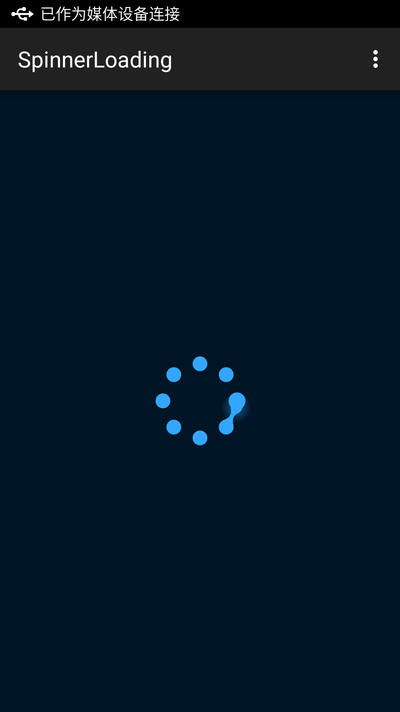

[](http://www.android-gems.com/lib/lusfold/SpinnerLoading)

# AWebDB

------

[](https://bintray.com/lusfold/maven/AWebDB/view)

[](https://bintray.com/lusfold/maven/SpinnerLoading/view)

# Quickstart


#### Preview




Inspired by [spinner-loader-gooey-light-effect](http://www.materialup.com/posts/spinner-loader-gooey-light-effect)

#### Dependency

``` gradle
dependencies {
compile 'com.lusfold.spinnerloading:spinnerloading:1.0.0'
}
```

#### In your layout

``` xml
<com.lusfold.spinnerloading.SpinnerLoading
        android:background="#001525"
        android:layout_width="wrap_content"
        android:layout_centerInParent="true"
        android:layout_height="wrap_content" /> 
```

#### Customization

``` java
SpinnerLoading view = findViewById(R.id.spinner_loading);
view.setPaintMode(1);
view.setCircleRadius(30);
view.setItemCount(8);
```


------

# LICENSE

Copyright 2014-2015 Lusfold(https://github.com/lusfold)

Licensed under the Apache License, Version 2.0 (the "License");you may not use this file except in compliance with the License.

You may obtain a copy of the License at

http://www.apache.org/licenses/LICENSE-2.0

Unless required by applicable law or agreed to in writing, software distributed under the License is distributed on an "AS IS" BASIS, WITHOUT WARRANTIES OR CONDITIONS OF ANY KIND, either express or implied. See the License for the specific language governing permissions and limitations under the License.